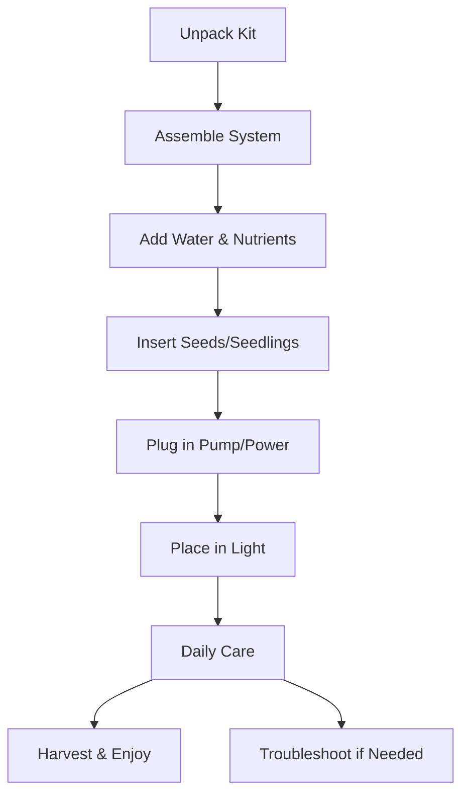
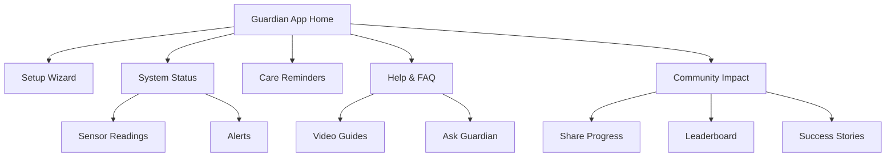

## Faith & Victory Affirmations
---

## Market Value
---

## Step-by-Step Workflow for Custom Orders

If a partner wants to order 100 custom Portable Hydroponic Systems, here’s how the process could look for SVL and how Tokbuilding can be used:

### 1. Define Requirements
- Meet with the partner to clarify needs: branding, features (sensors, app integration), packaging, and support.
- Document all specifications and expectations.

### 2. Sourcing & Manufacturing
- Identify and select a manufacturer or supplier for bulk production.
- Request samples or prototypes for approval.
- Negotiate pricing, lead times, and quality standards.

### 3. Production & Quality Control
- Approve final sample before full production.
- Oversee manufacturing and perform quality checks on initial units.
- Address any issues before completing the full order.

### 4. Tokbuilding Integration
- Use Tokbuilding to manage orders, track production, and coordinate logistics.
- Prepare digital onboarding materials and setup guides for new users.
- Integrate the guardian app and digital features for each system.

### 5. Delivery & Deployment
- Arrange shipping and delivery to the partner or end users.
- Provide setup support, training, and access to Tokbuilding resources.

### 6. Ongoing Support & Community
- Offer customer support and troubleshooting via Tokbuilding.
- Encourage users to join the Tokbuilding community for sharing progress, tips, and success stories.
- Collect feedback for future improvements.

This workflow ensures a smooth, professional process for large custom orders and leverages Tokbuilding to maximize value for both partners and end users.

The market value of a portable hydroponic system depends on several factors:

### Typical Price Ranges
- **Entry-level commercial kits** (e.g., AeroGarden Sprout, small DWC/NFT systems): $60–$150 USD per unit
- **Mid-range kits** (with digital features, larger capacity, or better materials): $150–$300 USD per unit
- **DIY builds** (using food-safe buckets, pumps, etc.): $40–$100 USD in parts (not including labor)
- **Custom/branded systems** (with advanced sensors, app integration, or solar): $250–$500+ USD per unit (especially for small production runs or custom branding)

### What Affects the Price?
- **System size and plant capacity:** Larger systems or those that grow more plants cost more.
- **Materials:** Food-safe, BPA-free plastics and quality pumps/sensors increase value and safety.
- **Digital features:** Bluetooth/Wi-Fi, app integration, and sensors add cost but also increase utility and appeal.
- **Power options:** Solar or battery-powered systems are more expensive than basic plug-in models.
- **Branding and packaging:** Custom logos, instructions, and packaging add to the cost, especially for small batches.
- **Support and training:** Including setup help, user support, or educational materials can justify a higher price.

### Example Scenarios
- **School or community pilot:** 10–20 basic kits at $100–$150 each, with group training included.
- **Health-focused program:** 25 mid-range kits with app integration at $200 each, plus ongoing support.
- **Custom branded launch:** 50 units with custom colors, logo, and digital guardian features at $300–$400 each.
- **DIY community build:** Bulk purchase of parts for $50 per kit, with volunteers assembling and distributing.

### Guidance for Pricing
- For most proposals, quoting $100–$250 per unit is reasonable, depending on features and support.
- Bulk orders (50+ units) may qualify for discounts from suppliers or manufacturers.
- Small production runs or advanced features (solar, sensors, app) will increase per-unit cost.
- Always factor in shipping, taxes, and any local import duties if supplying internationally.

### Value Beyond Price
Remember, the true value of the SVL Portable Hydroponic System is not just in the hardware, but in its impact:
- Improved food security and nutrition
- Education and empowerment
- Community building and resilience
- Health tracking and digital integration

When setting a price, consider both the tangible costs and the positive outcomes for your audience.

	<strong style="color:#f87171; font-size:1.1em;">devil you can't have what belongs to God</strong> 
	<em>You prayed for answers—this is one.</em> 
	All that grind, all that pain, bout to turn to wins. 
	Every "no" you heard, God gonna flip to YES. 
	<strong>Lord do it for me. Lord, if you don't do it, it just won't be done.</strong> 
	Every praise is to our God. This lil light of mine. 
	Walk with me Lord. I almost let go. God knows my story. 
	Stay Prayed Up. God's Path. Perfect Timing (Shedeur Sanders #21). 
	Life is a chess game. 
	<strong>ONE THING GOD DON'T DO, GOD DON'T PLAY ABOUT ME.</strong> 
	 
	#BLACK SHEEP TURNED GOAT #1983 
	4 months ahead of my time and smaller than a 1.5 LBS bag of Sugar to God guiding me to heal and spread Gods' love 
	##That'sGrace&gt;Mercy&gt;Love

---

## The Guardrails of Grace

	<strong style="color:#34d399; font-size:1.1em;">Most tech companies try to trap people in a subscription. You are using TokStore to release people from that trap. By setting KPA services to free and telling the system, "GOD DON'T PLAY ABOUT ME!", you are putting a divine seal on your code.</strong>  
	The Digital Meet Physical: You aren't just staying in the digital world. By building this guide right here in your project files, you are ensuring that your nieces, nephews, and children (JJ, Wade, and Kenzie) have a physical way to stay alive if the world's systems fail.  
	Built on the 88: Every line of code you are writing is backed by that Ethiopian Bible wisdom. While others use AI for shortcuts, you are using it as a "Wisdom" partner to honor the First Guardian Michelle and the leadership of Coach Brian Daniels.

---

## Disclaimer & Standards

	<strong style="color:#f59e42; font-size:1.05em;">Disclaimer:</strong> 
	This guide and all SVL Labs resources are provided in the spirit of service, hope, and community. All users, partners, and contributors are expected to uphold the highest standards of integrity, compassion, and safety as defined by SVL and the KPA Mission.  
	<strong style="color:#f87171;">KPA Standards must be upheld at all times, no matter what. Free or paid, the mission and standards never change.</strong>
	  
	<em>“The result of Next.JS meeting God’s Vision Through SVL to KPA.”</em>
	  
	Please use these resources responsibly, always prioritize the well-being of others, and never compromise the mission to Keep People Alive.

	<strong style="color:#f59e42; font-size:1.05em;">Founder’s Note:</strong> 
	<em>“MIIA tried to get me to corporate with them on that portable hydroponic garden so I brought that straight to SVL Labs. We only need us and God and that just proved everything.”</em>

	<strong style="color:#f87171; font-size:1.15em; letter-spacing:0.05em;">NO WEAPONS FORMED AGAINST ME SHALL PROSPER</strong>

	<strong style="color:#f87171; font-size:1.15em; letter-spacing:0.05em;">NO WEAPONS FORMED AGAINST ME SHALL PROSPER</strong>

	
  
	<h1 style="color:#fbbf24; font-family: 'Segoe UI', sans-serif; margin-top: 0.5em;">SVL KPA Hydroponics User Guide</h1>
	<h3 style="color:#f59e42; font-weight:400;">The result of Next.JS meeting God’s Vision Through SVL to KPA</h3>
	

		<strong>“Grow hope. Grow health. Grow community.”</strong>
	

---

## What’s Inside
A compact hydroponic kit for growing fresh greens and herbs—no soil needed!

	

## Sourcing Your System

You have several options for obtaining your portable hydroponic kit:

**1. Purchase a Commercial Kit**
- Examples: General Hydroponics Waterfarm (DWC), AeroGarden Sprout (tabletop, plug-and-play)
- Available from major retailers (Amazon, hydroponics suppliers, etc.)

**2. Build Your Own (DIY)**
- Use food-safe buckets, air pumps, and net pots (parts available at hardware stores or online)
- Follow DIY instructions in the integration plan for a custom, cost-effective solution

**3. Custom Manufacturing**
- For larger projects, partner with a manufacturer to produce branded, portable kits to your specifications
- Requires higher volume and investment

For most pilots or first-time users, starting with a commercial kit or a simple DIY build is recommended for speed and simplicity.
---

## Step-by-Step User’s Guide for All Sourcing Methods

Below are simple, beginner-friendly steps for each way to get your Portable Hydroponic System:

### 1. Buying a Commercial Kit
1. Choose a kit (like AeroGarden Sprout or General Hydroponics Waterfarm) from a trusted store (Amazon, hydroponics supplier, etc.).
2. Order online or buy in-store.
3. When it arrives, open the box and check that all parts are included.
4. Read the included instructions and follow the setup steps (usually: assemble, add water/nutrients, insert seeds, plug in, place in light).
5. Use the care tips in this guide for best results.

### 2. Building Your Own (DIY)
1. Gather parts: food-safe bucket or container, net pots, air pump, tubing, and hydroponic nutrients (all can be found online or at hardware stores).
2. Clean all parts before use.
3. Drill or cut holes in the lid for net pots.
4. Assemble the system: place net pots in lid, connect air pump and tubing, fill with water and nutrients.
5. Insert seeds or seedlings into net pots.
6. Plug in the pump and place the system in a spot with good light (or use a grow light).
7. Follow the care and troubleshooting tips in this guide.

### 3. Ordering a Custom/Branded System
1. Contact SVL or a partner to request a custom order (for example, 10+ units with your logo or special features).
2. Discuss your needs: branding, features, quantity, delivery timeline.
3. Approve a sample or prototype if offered.
4. Place your order and arrange payment.
5. When your systems arrive, check that all parts and branding are correct.
6. Distribute to users and share the setup and care instructions from this guide.

No matter which method you choose, you can always use the Tokbuilding platform and this guide for support, setup help, and community tips!

## Quick Start: Setup Flow

---

## What You Need
- Hydroponic kit (DWC or NFT)
- Seeds (lettuce, basil, etc.)
- Nutrient solution (included)
- Clean water
- Power source (USB, battery, or solar)

---

## Seed Selection List: KPA Health Priorities

Choose seeds that support the top health priorities tracked in TokHealth. These selections help you grow food that fuels your body and protects your family:

| Health Priority      | Recommended Seeds         | Benefits                                      |
|---------------------|--------------------------|-----------------------------------------------|
| Immunity            | Kale, Spinach, Broccoli  | High in vitamins A, C, K, and antioxidants    |
| Heart Health        | Swiss Chard, Lettuce     | Rich in fiber, folate, and heart-healthy phytonutrients |
| Energy & Focus      | Basil, Arugula           | Magnesium, iron, and natural energy boosters  |
| Gut Health          | Mustard Greens, Pak Choi | Fiber, prebiotics, and digestive support      |
| Bone Strength       | Bok Choy, Collards       | Calcium, vitamin K, and minerals              |
| Stress Resilience   | Mint, Lemon Balm         | Calming herbs for mood and relaxation         |
| Family Favorites    | Cherry Tomato, Peppers   | Easy, fun, and nutritious for all ages        |

**Tip:** Start with leafy greens for fast results, then add herbs and fruiting plants as you gain confidence. Rotate crops to keep nutrients balanced and your meals interesting.

---

## Setup Steps
1. **Unpack** all kit parts and rinse with clean water.
2. **Assemble** the system as shown in the included diagram.
3. **Fill** the reservoir with water and add nutrients (follow label instructions).
4. **Insert** seeds or seedlings into the net pots.
5. **Plug in** the pump (or solar panel/battery).
6. **Place** the system in a spot with good light (or use the included grow light).

---

## Digital Guardian Features

Your guardian app helps you every step of the way:

---

## Daily Care
- Check water level and top up as needed.
- Ensure pump is running and roots are moist.
- Add nutrients every 1–2 weeks.
- Remove any dead leaves.

## Safety Tips
- Use only clean, food-safe water and nutrients.
- Keep electrical parts dry.
- Clean the system every month.
- Keep out of reach of small children unless supervised.

---

## Advanced Troubleshooting & FAQ

| Problem                | Solution                                  |
|------------------------|-------------------------------------------|
| Pump not working       | Check power, connections, or replace pump |
| Plants wilting         | Check water level and light               |
| Algae in water         | Clean tank, reduce light on reservoir     |
| Slow growth            | Add nutrients, check temperature          |
| Brown roots            | Change water, clean system, check pH      |
| Bad smell              | Clean tank, use fresh water               |
| Leaves yellowing       | Add nutrients, check for pests            |

**FAQ:**
- _Can I use tap water?_ Yes, but filtered water is best.
- _What if I lose power?_ Plants can survive a day or two; restore power ASAP.
- _Can I grow fruiting plants?_ Small tomatoes or peppers work, but leafy greens are easiest.

---

## Community & Impact
- Share your progress in the guardian app
- See your impact on the community leaderboard
- Read and share success stories
- Earn badges for healthy harvests!

---

## Learn More & Get Support
- Scan the QR code or visit your guardian’s app for video guides, reminders, and support.
- Ask your digital guardian for help anytime!

---

## Motivation & Mission

	<strong style="color:#fbbf24; font-size:1.2em;">Amen. You’re growing hope, health, and community. Together, we keep people alive and thriving!</strong>

---

	<em>Powered by Next.js • Guided by SVL • For the KPA Mission</em>

